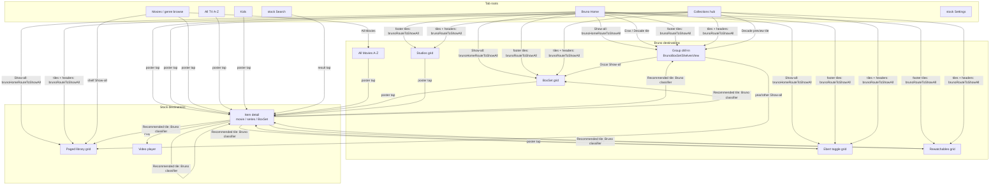

# NAVIGATION_MAP — the true screen graph, and where stock takes over

Authored 2026-07-01 (Fable assessment thread). Verified against worktree HEAD `53685816`.
All paths repo-relative.

**How this doc relates to `docs/BRUNO_NAV_MAP.md`.** The nav map stays canonical for
per-surface shelf layout and Show-all destinations. THIS document is the screen-level graph:
every screen, every route in and out, who owns each screen (Bruno vs stock Swiftfin), and an
explicit list of the junctions where models get lost. Read this first when a navigation
question feels cloudy; read the nav map for shelf detail.

---

## 1. The three navigation vocabularies

Bruno navigation is confusing because THREE mechanisms coexist. Every transition in the app
is exactly one of these:

1. **Tab selection** — `MainTabView` + `TabCoordinator`. tvOS tab order (verified,
   `Shared/Coordinators/Tabs/MainTabView.swift:38-44`): Search, Home, Collections, Movies,
   TV Shows, Kids, Settings. Roots in `TabItem.swift` (`:47` home, `:79` movies, `:89`
   tvShows, `:101` collections, `:113` kids, `:124` search, `:147` settings).
2. **Bruno routes** — `NavigationRoute` factories DEFINED INSIDE BRUNO VIEW FILES (not in
   `Shared/Coordinators`). They open Bruno-owned screens. Complete list in §3.
3. **Stock routes** — `.item(item:)`, `.library(library:)`, and the player. They open stock
   Swiftfin screens. Bruno never modifies the player or the navigation engine.

A fourth mechanism rides on top: Bruno "covers" (the pushed hero-banner surfaces such as the
Decades drill-in) are presented as separate hosting controllers that do NOT inherit
`TabCoordinator` from the environment. `BrunoTabBridge`
(`Shared/Coordinators/Tabs/BrunoTabBridge.swift:25`) publishes a live weak reference to the
coordinator so the in-cover menu bar (`BrunoCoverMenuBarRow`,
`Swiftfin tvOS/Views/BrunoHomeView/BrunoHeroMenuBar.swift`) can read tabs and switch: it
DISMISSES the cover first, THEN selects the tab (dismiss-then-switch). A menu bar inside a
cover without the bridge would be dead chrome.

---

## 2. Screens

| Screen | Owner | File | Reached by |
|---|---|---|---|
| Bruno Home | Bruno | `BrunoHomeView.swift` | Home tab |
| Collections hub | Bruno | `BrunoCollectionsView.swift` (renders `BrunoCategoryShelves`) | Collections tab |
| Movies / genre browse | Bruno | `BrunoMoviesView.swift` -> `BrunoGenresView.swift` | Movies tab |
| All TV (A-Z) | Bruno | `BrunoMediaView.swift` (series) | TV Shows tab; `brunoTVGrid` |
| All Movies (A-Z) | Bruno | `BrunoMediaView.swift` (movie) | `brunoMoviesGrid` (Movies pill, Home footer, Genres fallback) |
| Kids | Bruno | `BrunoKidsView.swift` | Kids tab |
| Group drill-in (Decades / Oscars / Cities / generic shelves) | Bruno | `BrunoBoxSetShelvesView.swift` | `brunoCategoryShelves` |
| Genres cover (from a Recommended genre-hub tap etc.) | Bruno | `BrunoGenresView.swift` | `brunoGenres` |
| BoxSet grid (Directors, Movie Stars, Boxed Sets, New Releases, Oscar category) | Bruno | `BrunoBoxSetGridView.swift` | `brunoBoxSetGrid` |
| Studios grid | Bruno | `BrunoStudiosGridView.swift` | `brunoStudiosGrid` |
| Ebert toggle grid | Bruno | `BrunoEbertView.swift` | `brunoEbert` |
| Rewatchables grid | Bruno | `BrunoRewatchablesView.swift` | `brunoRewatchables` |
| Item detail (movie / series / BoxSet) | **stock** (+ Bruno Recommended shelf) | `Swiftfin tvOS/Views/ItemView/` | `.item(item:)` from ~14 Bruno call sites |
| Paged library grid | **stock chrome** | `PagingLibraryView` | `.library(...)` (stock `ItemLibrary` or Bruno `BrunoQueryLibrary`) |
| Video player | **stock** | untouched | Play on stock detail only |
| Search | **stock** (+ `brunoUtilityTabBar`) | stock `SearchView` | Search tab |
| Settings | **stock** (+ `brunoUtilityTabBar`) | stock `SettingsView` | Settings tab |

---

## 3. Bruno route factories (the complete routing vocabulary)

Factories live in the view files they open. There is no central route registry for Bruno
routes; this table is that registry.

| Route | Defined at | Opens | Called from |
|---|---|---|---|
| `brunoCategoryShelves(parent:subGroups:decade:)` | `BrunoBoxSetShelvesView.swift:1188` | group drill-in (pill view when `decade` set; six Oscar shelves when `subGroups` set) | both routers, Decade tile taps (`BrunoShelfView.swift:214`, `BrunoCategoryShelves.swift:593`), Recommended (`BrunoRecommendedShelf.swift:149`) |
| `brunoGenres(parent:core:)` | `BrunoGenresView.swift:355` | genre browse cover | `brunoRouteToShowAll` `.genres` (`BrunoCategoryCardRow.swift:117`) |
| `brunoBoxSetGrid(...)` | `BrunoBoxSetGridView.swift:391` | static/captioned BoxSet grid (cinematic when `heroAsset`; Oscar mode when `oscarCategory`) | both routers, Recommended `.oscar` |
| `brunoStudiosGrid(title:items:)` | `BrunoStudiosGridView.swift:226` | cinematic studios grid | `brunoRouteToShowAll` `.grid` studios branch (`BrunoCategoryCardRow.swift:224`) |
| `brunoEbert(up:down:showingDown:)` | `BrunoEbertView.swift:418` | Ebert toggle grid | both routers, `BrunoCategoryShelves.showAll` Ebert special case (`:539`), Recommended |
| `brunoRewatchables(parent:)` | `BrunoRewatchablesView.swift:342` | Rewatchables grid | `brunoRouteToShowAll` `.rewatchables` (`BrunoCategoryCardRow.swift:149`), Recommended |
| `brunoMoviesGrid` / `brunoTVGrid` | `BrunoMoviesView.swift:97/:107` | A-Z grids | Movies pill (`BrunoMoviesView.swift:46`), Home footer (`BrunoHomeView.swift:189/:192`) |
| `brunoItemsGrid(title:items:)` | `Shared/Objects/Bruno/BrunoStaticItemsLibrary.swift:46` | static items grid | **NO CALLERS (dead, 2026-07-01)** |

**The two Show-all routers** (both real; different inputs):

- `brunoRouteToShowAll(_:router:namespace:)` — BROWSE. Defined
  `BrunoCategoryCardRow.swift:110`, switches on `BrunoCollectionCategory.drillStyle`
  (`.genres / .shelves / .items / .grid / .rewatchables`). Callers: category tile taps
  (`BrunoCategoryCardRow.swift:88`) and browse shelf headers
  (`BrunoCategoryShelves.swift:543`, after an Ebert special case at `:539`).
- `brunoHomeRouteToShowAll(shelf:snapshot:router:namespace:)` — HOME. Defined
  `BrunoHomeShowAll.swift:35`, switches on `shelf.kind` then `query.caption`. Single caller:
  the trailing Show-all card in `BrunoShelfView.swift:205`.

`CLAUDE.md` says "all show-all routing funnels through brunoRouteToShowAll()". Read that as
shorthand for "one router per surface family"; the precise seam is the two functions above.

---

## 4. The navigation graph

---

## 5. Stock-handoff junctions (where the graph gets cloudy) — read carefully

**J1. Poster tap = stock detail, always.** Every film/series poster anywhere opens stock
`ItemView` via `.item(item:)`. Call sites: `BrunoShelfView.swift:216`,
`BrunoHeroView.swift:98/:232`, `BrunoCategoryShelves.swift:595`, `BrunoKidsView.swift:155`,
`BrunoMediaView.swift:102`, `BrunoEbertView.swift:268`, `BrunoRewatchablesView.swift:158`,
`BrunoStudiosGridView.swift:138`, `BrunoBoxSetGridView.swift:154/:160`,
`BrunoRecommendedShelf.swift:146`, `BrunoCategoryCardRow.swift:263`. There is no Bruno
detail page. Play lives on stock detail; direct hero-play is a deferred backlog item.

**J2. The one Bruno beachhead inside stock: the Recommended shelf.** Stock `ItemView`'s
similar-items row is classified and rerouted by `BrunoRecommendedShelf.swift`
(`brunoRecommendedTarget` `:56`, router `:127`), mounted from `SimilarItemsHStack.swift`.
Rules: recognized nav-hub groups are dropped; recognized content collections reroute to
their branded surfaces; **unrecognized BoxSets and cold-snapshot tiles FAIL OPEN to stock
`.item`** (never drop; dropping emptied the shelf on Director/Actor/Studio pages). If you
are reading an older doc that says unresolved tiles are dropped, it is stale.

**J3. `.library(...)` = stock chrome, sometimes Bruno data.** A Show-all that opens
`.library(BrunoQueryLibrary(...))` (`BrunoHomeShowAll.swift:128-131`) is a STOCK
`PagingLibraryView` screen paging a BRUNO query. Visually it is stock. Do not look for a
Bruno grid file for these destinations; there is none.

**J4. BoxSet posters: inline tap goes stock, Show-all goes branded.** This recurring split
is the single biggest confusion generator:

| BoxSet kind | Inline poster tap | Show-all / card route |
|---|---|---|
| Director / Movie Star set | stock BoxSet detail (`BrunoBoxSetGridView.swift:154`, `BrunoCategoryShelves.swift:595`) | branded `brunoBoxSetGrid` art-carousel grid |
| Decade set | **pill view** (`BrunoShelfView.swift:214`, `BrunoCategoryShelves.swift:593`, rerouted 2026-06-30) | pill view (`brunoCategoryShelves(decade:)`) |
| Franchise (Boxed Sets) | stock BoxSet detail (correct: the stock collection page IS the franchise page) | landscape `brunoBoxSetGrid` of all franchises |
| Home "Browse by Director" (Auteurs) tile | stock BoxSet detail — the KNOWN residual (nav map §8 #4) | Show-all opens the branded Directors grid |

The stock BoxSet detail (`CollectionItemContentView`) then shows its own children grid and a
Bruno-routed Recommended shelf (J2). Tapping a director set inline therefore lands you on a
stock screen whose Recommended row routes back into Bruno surfaces. That round trip is
by design, not a bug.

**J5. Covers and the menu bar.** Bruno covers (drill-ins, A-Z grids) are separate hosting
controllers. Their first scroll row is `BrunoCoverMenuBarRow` (dismiss-then-switch via
`BrunoTabBridge`); tab roots instead get `BrunoScrollingMenuBar` (live `TabCoordinator`).
Both bars SCROLL AWAY with content; nothing is pinned. If you add a surface, pick the right
bar by asking "tab root or pushed cover" (`BrunoCategoryShelves.isTabRoot`).

**J6. Search and Settings are stock.** Only the fixed utility tab bar wrapper is Bruno
(`TabItem.swift:124/:147`). A search result tap opens stock `.item` (J1 applies from there).

**J7. The player is untouched.** No Bruno file routes to the video player. The only path is
stock detail -> Play.

---

## 6. Same content, different route — the full divergence list

Legitimate by design, but models must not "fix" one side to match the other without an
owner decision:

1. **Auteurs residual (open item):** Home "Browse by Director" tile-tap -> stock `.item`;
   every other director entry point -> branded grid or pill routing. Tracked in
   `docs/BRUNO_NAV_MAP.md` §8 #4 / §9 #4.
2. **Genre content:** Home/Movies genre SHELVES are modern-years-only; genre Show-all grids
   are all years, newest first (classics sink). Deliberate (owner rule).
3. **Decade "Best of" and "Other" shelves:** their Show-all opens the decade's FULL
   unfiltered library (no server filter exists for `bruno-sig:` or the Other bucket).
   Nav map §8 #1/#2.
4. **Franchise sets:** Recommended classifies a franchise to `.filmsGrid`
   (`ItemLibrary(parent:)`), while the Boxed Sets grid tap opens stock BoxSet detail.
   Both are terminal film lists; the chrome differs.
5. **Ebert:** the Roger Ebert CARD opens the toggle grid directly; an Ebert SHELF's Show-all
   opens the same grid pre-set to that shelf's verdict; a lone Ebert BoxSet outside the pair
   opens the single-set grid (`BrunoCategoryCardRow.swift:171`). Three doors, one room.

---

## 7. Do / do not (for models editing navigation)

- DO add new Show-all behavior as a branch in ONE of the two routers, never inline at a
  call site.
- DO define a new Bruno route factory in the view file it opens, and add it to the §3 table.
- DO NOT route a synthetic category (label-only stub BoxSet, e.g. per-year decade
  categories) through `ItemLibrary(parent: category.boxSet)`; use `gridParent`/`gridYear`
  (`BrunoCategoryCardRow.swift:200-209`) or you page the whole library.
- DO NOT change the Recommended fail-open to drop (J2).
- DO NOT give a cover a `BrunoScrollingMenuBar` or a tab root a `BrunoCoverMenuBarRow` (J5).
- DO NOT touch the player, `NavigationRoute` internals, or `Router` (upstream engine).
